# Codebase Summary: Property Tax Appeal Platform

## Project Overview
A web application that automates property tax appeals for residential property owners in the United States. The platform reduces the complexity of challenging overassessed property valuations through automated analysis, form generation, and submission guidance.

## Current Project State
**Status:** Planning and documentation phase complete, ready for implementation
**Phase:** MVP Development (Months 1-3 of roadmap)
**Architecture:** Monolithic web application with React frontend and Node.js backend

---

## Key Components and Interactions

### System Architecture
```
┌─────────────────┐    ┌─────────────────┐    ┌─────────────────┐
│   React         │    │   Vercel        │    │  Supabase       │
│   Frontend      │◄──►│   Serverless    │◄──►│  PostgreSQL     │
│   (Vercel)      │    │   Functions     │    │  Database       │
│                 │    │   (API)         │    │  (Supabase)     │
└─────────────────┘    └─────────────────┘    └─────────────────┘
       │                       │                       │
       │                       │                       ▼
       │                       │            ┌─────────────────┐
       │                       │            │  Supabase       │
       │                       │            │  Storage       │
       │                       │            │  (Files)        │
       │                       │            └─────────────────┘
       │                       │
       │                       ▼
       │            ┌─────────────────┐
       │            │  External APIs  │
       │            │                 │
       │            │ • RentCast      │
       │            │ • Google Maps   │
       │            │ • Resend Email  │
       │            │                 │
       │            └─────────────────┘
       │                       │
       │                       ▼
       │            ┌─────────────────┐
       │            │  Vercel Cron    │
       │            │  (Scheduled     │
       │            │   Jobs)         │
       │            └─────────────────┘
```

### Core User Flows

#### Primary Appeal Flow
1. **Property Lookup** → User enters address, system retrieves property data
2. **Analysis** → Compare assessment to market values, determine over-assessment
3. **Authentication** → Secure account creation for document access
4. **Evidence Review** → Display comparable sales and adjustments
5. **Form Generation** → Create jurisdiction-specific appeal forms
6. **Submission Guidance** → Step-by-step instructions for filing
7. **Status Tracking** → Dashboard for appeal progress monitoring

#### Supporting Flows
- **Multi-Property Management** → Portfolio view for property investors
- **Deadline Management** → Calendar integration and automated reminders
- **Document Storage** → Secure access to generated forms and correspondence

---

## Data Flow

### Property Analysis Flow (User Entry → RentCast → Analysis → Decision)

```mermaid
flowchart TD
    Start([User Enters Address]) --> Validate[Google Maps Autocomplete<br/>Validates & Geocodes Address]
    Validate -->|Valid Address| Extract[Extract: street, city, state, zip<br/>lat, lng coordinates]
    Validate -->|Invalid Address| Error1[Show Validation Error<br/>Request Correct Format]
    
    Extract --> RentCastProperty[RentCast API Call<br/>GET /v1/property<br/>Query: address]
    
    RentCastProperty -->|Success| PropertyData[Receive Property Data:<br/>• ID<br/>• Assessed Value<br/>• Property Characteristics<br/>• Tax Amount<br/>• Latitude/Longitude]
    RentCastProperty -->|Not Found| Fallback[Try County Assessor Scraping<br/>or Manual Entry]
    
    PropertyData --> RentCastComparables[RentCast API Call<br/>GET /v1/listings/sale<br/>Query: lat, lng, radius=1.0<br/>Status: Sold]
    
    RentCastComparables -->|Success| ComparablesData[Receive Comparable Sales:<br/>• Address<br/>• Sale Price<br/>• Sale Date<br/>• Distance from Subject<br/>• Property Characteristics<br/>• Pre-filtered by RentCast]
    RentCastComparables -->|No Results| InsufficientData[Show Warning:<br/>Insufficient Comparables<br/>Expand Radius or Manual Entry]
    
    ComparablesData --> Filter[Filter Comparables:<br/>• Square Footage ±20%<br/>• Bedrooms ±1<br/>• Bathrooms ±1<br/>• Lot Size ±25%<br/>• Within 1 mile radius<br/>• Sold in last 6 months]
    
    Filter -->|Less than 3| InsufficientData
    Filter -->|3+ Comparables| Adjust[Calculate Price Adjustments:<br/>• Size difference<br/>• Bedroom difference<br/>• Bathroom difference<br/>• Lot size difference<br/>• Age difference<br/>• Condition difference]
    
    Adjust --> CalculateMarketValue[Calculate Market Value:<br/>Average of Adjusted Prices<br/>from All Comparables]
    
    CalculateMarketValue --> Compare[Compare Assessment vs Market Value:<br/>• Assessment: Property.assessedValue<br/>• Market Value: Calculated Average<br/>• Difference: Assessment - Market Value<br/>• Percentage: Difference / Market Value]
    
    Compare --> Decision{Overassessed?<br/>Percentage > 5%}
    
    Decision -->|Yes > 5%| Overassessed[✅ Likely Over-assessed<br/>• Market Value Estimate<br/>• Overassessed Amount<br/>• Overassessed Percentage<br/>• Potential Tax Savings<br/>• Confidence Level]
    
    Decision -->|No ≤ 5%| FairlyAssessed[✅ Fairly Assessed<br/>• Market Value Estimate<br/>• Assessment Difference<br/>• Confidence Level<br/>• Recommendation: No Appeal]
    
    Overassessed --> Confidence[Determine Confidence Level:<br/>• High: 5+ comparables<br/>• Medium: 3-4 comparables<br/>• Low: < 3 comparables]
    
    FairlyAssessed --> Confidence
    
    Confidence --> CalculateSavings[Calculate Potential Savings:<br/>Overassessed Amount × Tax Rate<br/>Estimated Annual Savings]
    
    CalculateSavings --> Display[Display Analysis Results:<br/>• Verdict<br/>• Market Value Estimate<br/>• Potential Savings<br/>• Comparable Count<br/>• Confidence Level<br/>• Explanation]
    
    Display --> End([User Views Results])
    
    InsufficientData --> ManualEntry[Allow Manual Entry<br/>or Suggest Professional Appraisal]
    Fallback --> ManualEntry
    
    style Start fill:#e1f5ff
    style End fill:#d4edda
    style Overassessed fill:#f8d7da
    style FairlyAssessed fill:#d1ecf1
    style Error1 fill:#f8d7da
    style InsufficientData fill:#fff3cd
    style RentCastProperty fill:#d4edda
    style RentCastComparables fill:#d4edda
    style Decision fill:#fff3cd
```



### Property Data Pipeline
```
User Address Input
        ↓
Google Maps API (Geocoding)
        ↓
RentCast API (Property Data)
        ↓
Database Storage (Properties Table)
        ↓
Analysis Engine (Comparable Matching)
        ↓
User Display (Analysis Results)
```

### Appeal Process Flow
```
Property Analysis Complete
        ↓
User Account Creation
        ↓
Comparable Sales Selection
        ↓
Form Template Selection (by Jurisdiction)
        ↓
PDF Generation (PDF-lib)
        ↓
Document Storage (Supabase Storage)
        ↓
Submission Instructions Display
        ↓
Status Tracking (Database Updates)
```

### Notification System
```
Deadline Database Query
        ↓
User Preference Check
        ↓
Email Template Selection
        ↓
Resend API (Email Only - No SMS for MVP)
        ↓
Delivery Confirmation
        ↓
Analytics Tracking
```

---

## External Dependencies

### Critical External Services

#### **RentCast API** (Primary Data Source)
- **Purpose:** Property characteristics, assessment data, comparable sales
- **Data Coverage:** 140M+ US properties, updated daily
- **Integration:** REST API with authentication
- **Fallback:** County assessor web scraping (future)
- **Cost:** Free tier for development, usage-based pricing
- **Risk Level:** High - core business functionality depends on this

#### **Google Maps Places API** (Address Services)
- **Purpose:** Address autocomplete, validation, geocoding
- **Usage:** Property search input, location services
- **Integration:** JavaScript SDK for frontend, REST API for backend
- **Cost:** Generous free tier ($200/month), $5/1,000 requests
- **Risk Level:** Medium - graceful degradation possible

#### **Resend API** (Email Communications)
- **Purpose:** Deadline reminders, account notifications, form delivery
- **Integration:** REST API with SMTP-like interface
- **Templates:** Custom HTML templates for professional appearance
- **Cost:** Volume-based pricing, developer-friendly
- **Risk Level:** Low - alternative email services available

#### **Twilio API** (SMS Communications - Post-MVP)
- **Purpose:** Critical deadline reminders (1 day before) - Not included in MVP
- **Integration:** REST API with SDK support
- **Cost:** Pay-per-message pricing
- **Risk Level:** Low - SMS is enhancement, not core feature
- **Status:** Planned for future, not MVP

#### **Supabase Storage** (File Storage)
- **Purpose:** Generated PDF forms, user document storage, form templates
- **Integration:** Supabase SDK for file upload/download
- **Security:** Private buckets with signed URLs
- **Cost:** Free tier includes 1GB storage, pay-per-GB at scale
- **Risk Level:** Low - alternative storage providers available

### Integration Patterns

#### API Client Architecture
```typescript
// Consistent error handling and retry logic
class ApiClient {
  async request(endpoint: string, options: RequestOptions) {
    try {
      const response = await fetch(endpoint, options);
      if (!response.ok) {
        throw new ApiError(response.status, await response.text());
      }
      return await response.json();
    } catch (error) {
      // Retry logic, error logging, fallback handling
      throw new ExternalServiceError(error.message);
    }
  }
}
```

#### Service Layer Abstraction
```typescript
// External service interfaces for testability
interface PropertyDataService {
  getPropertyByAddress(address: Address): Promise<PropertyData>;
  getComparableSales(propertyId: string): Promise<Comparable[]>;
}

class RentCastService implements PropertyDataService {
  // Implementation with RentCast API
}
```

---

## Database Schema Overview

### Core Tables

#### **Users Table**
- User authentication and profile information
- Subscription tier tracking (free/premium/professional)
- Notification preferences

#### **Properties Table**
- Property address and geographic data
- Assessment information and tax amounts
- Links to user accounts (multi-property support)

#### **Appeals Table**
- Appeal status tracking (draft → submitted → approved/denied)
- Deadline management and reminder scheduling
- Generated form metadata and storage links

#### **Comparables Table**
- Comparable property data for appeal evidence
- Price adjustments and analysis results
- Source tracking (API vs. manual entry)

#### **Jurisdictions Table**
- County/state filing deadline rules
- Form template mappings and requirements
- Submission process documentation

### Key Relationships
- **Users → Properties** (1:many) - Users can have multiple properties
- **Properties → Appeals** (1:many) - Properties can have multiple appeals over time
- **Appeals → Comparables** (1:many) - Appeals use multiple comparable properties
- **Properties → Jurisdictions** (many:1) - Properties belong to specific jurisdictions

### Performance Considerations
- RentCast API handles geographic queries natively (no Haversine/PostGIS needed)
- Composite indexes on commonly filtered columns
- JSON columns for flexible property attribute storage
- Foreign key constraints for data integrity

---

## Recent Significant Changes

### Planning Phase Completion
- ✅ **Comprehensive PRD** - Product requirements and user flows defined
- ✅ **Technical Architecture** - Tech stack and system design finalized
- ✅ **TDD Development Plan** - Testing strategy and development approach established
- ✅ **External API Analysis** - RentCast integration plan completed

### Documentation Framework
- ✅ **Project Roadmap** - Feature roadmap and success criteria defined
- ✅ **Current Task Definition** - Frontend design objectives established
- ✅ **Technology Stack** - Tech choices and justifications documented
- ✅ **Codebase Summary** - This document created for project overview

### Development Readiness
- 🔄 **Development Environment** - Project structure and tooling setup pending
- 🔄 **Component Architecture** - Design system and component patterns pending
- 🔄 **API Integration** - External service connections pending
- 🔄 **Authentication System** - User management and security pending

---

## User Feedback Integration

### Current State
- **No user feedback yet** - Pre-MVP development phase
- **Planning based on:** Market research, competitor analysis, user persona development
- **Feedback mechanisms planned:** Beta user testing, NPS surveys, support ticket analysis

### Future Integration Points
- **User Testing:** Beta user flow validation and iteration
- **Analytics:** PostHog implementation for user behavior insights
- **Support:** User feedback collection through help system
- **Surveys:** Post-appeal success surveys and NPS tracking

### Feedback-Driven Improvements
- **UI/UX Iteration:** A/B testing for key flows and conversion optimization
- **Feature Prioritization:** User pain point identification and roadmap adjustment
- **Support Enhancement:** Common question identification and self-service improvements

---

## Development Priorities

### Immediate Next Steps (Week 1-2)
1. **Environment Setup** - Initialize project with chosen tech stack
2. **Component Library** - Build basic UI components and design system
3. **Property Lookup** - Implement address search and data retrieval
4. **Analysis Engine** - Create over-assessment detection logic
5. **User Authentication** - Secure account creation and management

### Medium-term Goals (Month 1)
1. **Core User Flow** - Complete end-to-end appeal creation process
2. **Form Generation** - PDF creation and jurisdiction-specific templates
3. **Dashboard** - User account and appeal status management
4. **Testing** - Comprehensive test coverage and quality assurance

### Quality Assurance
- **Code Coverage:** Target 80%+ for critical business logic
- **Performance:** < 2 second page loads, < 10 second analysis completion
- **Accessibility:** WCAG 2.1 AA compliance for inclusive design
- **Security:** SOC 2 compliant data handling and user privacy

---

## Architecture Decisions and Trade-offs

### Monolithic vs. Microservices
**Decision:** Start with monolithic architecture for MVP speed
**Rationale:** Simpler deployment, easier testing, faster development
**Future Migration:** Service separation when scaling requirements become clear

### API-First Design
**Decision:** Build comprehensive REST API from day one
**Rationale:** Enables future mobile apps, third-party integrations, testing
**Trade-off:** Additional upfront development time vs. long-term flexibility

### External API Dependency
**Decision:** Heavy reliance on RentCast API for property data
**Rationale:** Superior data quality and coverage vs. building custom scraping
**Risk Mitigation:** Multiple fallback strategies, caching, user manual entry options

### Technology Choices
**Decision:** Modern JavaScript stack (React, Node.js, TypeScript)
**Rationale:** Developer productivity, ecosystem maturity, hiring availability
**Trade-off:** Higher memory usage vs. development velocity and maintainability

---

## Risk Assessment and Mitigation

### High-Risk Areas
- **RentCast API Reliability:** Core functionality dependency
  - *Mitigation:* Comprehensive caching, fallback scraping, clear user communication
- **Legal Compliance:** Complex tax law landscape across jurisdictions
  - *Mitigation:* Legal review of all content, comprehensive disclaimers, insurance
- **User Adoption:** Competition from established tax services
  - *Mitigation:* Superior UX, comprehensive jurisdiction coverage, strong SEO

### Technical Debt Prevention
- **Code Quality:** TypeScript strict mode, ESLint, Prettier
- **Testing:** TDD approach with comprehensive test coverage
- **Documentation:** Inline code documentation, API specs
- **Architecture:** Clean architecture principles, separation of concerns

### Scaling Considerations
- **Database Performance:** Query optimization, indexing strategy
- **API Rate Limits:** Request caching, queuing for external services
- **User Load:** Horizontal scaling preparation in architecture
- **Internationalization:** Unicode support, timezone handling

---

## Additional Documentation
- **styleAesthetic.md:** Comprehensive design system covering colors, typography, components, and interaction patterns
- **wireframes.md:** Low-fidelity wireframes defining core user flows and interface patterns
- These documents establish the visual and interaction foundation for the frontend implementation

---

*This codebase summary provides the foundation for understanding the Property Tax Appeal Platform architecture and development approach. Regular updates will track progress and architectural evolution as the project moves from planning to implementation.*
