# Property Analysis Flow Diagram

This diagram shows the complete flow from user address entry through RentCast API calls to the final overassessed decision.

```mermaid
flowchart TD
    Start([User Enters Address]) --> Validate[Google Maps Autocomplete<br/>Validates & Geocodes Address]
    Validate -->|Valid Address| Extract[Extract: street, city, state, zip<br/>lat, lng coordinates]
    Validate -->|Invalid Address| Error1[Show Validation Error<br/>Request Correct Format]
    
    Extract --> RentCastProperty[RentCast API Call<br/>GET /v1/property<br/>Query: address]
    
    RentCastProperty -->|Success| PropertyData[Receive Property Data:<br/>• ID<br/>• Assessed Value<br/>• Property Characteristics<br/>• Tax Amount<br/>• Latitude/Longitude]
    RentCastProperty -->|Not Found| Fallback[Try County Assessor Scraping<br/>or Manual Entry]
    
    PropertyData --> RentCastComparables[RentCast API Call<br/>GET /v1/listings/sale<br/>Query: lat, lng, radius=1.0<br/>Status: Sold]
    
    RentCastComparables -->|Success| ComparablesData[Receive Comparable Sales:<br/>• Address<br/>• Sale Price<br/>• Sale Date<br/>• Distance from Subject<br/>• Property Characteristics<br/>• Pre-filtered by RentCast]
    RentCastComparables -->|No Results| InsufficientData[Show Warning:<br/>Insufficient Comparables<br/>Expand Radius or Manual Entry]
    
    ComparablesData --> Filter[Filter Comparables:<br/>• Square Footage ±20%<br/>• Bedrooms ±1<br/>• Bathrooms ±1<br/>• Lot Size ±25%<br/>• Within 1 mile radius<br/>• Sold in last 6 months]
    
    Filter -->|Less than 3| InsufficientData
    Filter -->|3+ Comparables| Adjust[Calculate Price Adjustments:<br/>• Size difference<br/>• Bedroom difference<br/>• Bathroom difference<br/>• Lot size difference<br/>• Age difference<br/>• Condition difference]
    
    Adjust --> CalculateMarketValue[Calculate Market Value:<br/>Average of Adjusted Prices<br/>from All Comparables]
    
    CalculateMarketValue --> Compare[Compare Assessment vs Market Value:<br/>• Assessment: Property.assessedValue<br/>• Market Value: Calculated Average<br/>• Difference: Assessment - Market Value<br/>• Percentage: Difference / Market Value]
    
    Compare --> Decision{Overassessed?<br/>Percentage > 5%}
    
    Decision -->|Yes > 5%| Overassessed[✅ Likely Over-assessed<br/>• Market Value Estimate<br/>• Overassessed Amount<br/>• Overassessed Percentage<br/>• Potential Tax Savings<br/>• Confidence Level]
    
    Decision -->|No ≤ 5%| FairlyAssessed[✅ Fairly Assessed<br/>• Market Value Estimate<br/>• Assessment Difference<br/>• Confidence Level<br/>• Recommendation: No Appeal]
    
    Overassessed --> Confidence[Determine Confidence Level:<br/>• High: 5+ comparables<br/>• Medium: 3-4 comparables<br/>• Low: < 3 comparables]
    
    FairlyAssessed --> Confidence
    
    Confidence --> CalculateSavings[Calculate Potential Savings:<br/>Overassessed Amount × Tax Rate<br/>Estimated Annual Savings]
    
    CalculateSavings --> Display[Display Analysis Results:<br/>• Verdict<br/>• Market Value Estimate<br/>• Potential Savings<br/>• Comparable Count<br/>• Confidence Level<br/>• Explanation]
    
    Display --> End([User Views Results])
    
    InsufficientData --> ManualEntry[Allow Manual Entry<br/>or Suggest Professional Appraisal]
    Fallback --> ManualEntry
    
    style Start fill:#e1f5ff
    style End fill:#d4edda
    style Overassessed fill:#f8d7da
    style FairlyAssessed fill:#d1ecf1
    style Error1 fill:#f8d7da
    style InsufficientData fill:#fff3cd
    style RentCastProperty fill:#d4edda
    style RentCastComparables fill:#d4edda
    style Decision fill:#fff3cd
```



## Key Components

### 1. Address Validation (Google Maps)
- **Input:** User types address
- **Output:** Validated address + lat/lng coordinates
- **API:** Google Maps Places Autocomplete

### 2. Property Data Retrieval (RentCast)
- **Input:** Validated address
- **Output:** Property characteristics, assessed value, tax amount
- **API:** RentCast `/v1/property` endpoint

### 3. Comparable Sales Retrieval (RentCast)
- **Input:** Property latitude, longitude, radius (1.0 miles)
- **Output:** Pre-filtered comparable sales with distance included
- **API:** RentCast `/v1/listings/sale` endpoint with geographic parameters
- **Note:** RentCast handles geographic filtering natively - no Haversine needed!

### 4. Analysis Engine
- **Filtering:** Additional filtering by property characteristics
- **Adjustments:** Price adjustments for differences (size, beds, baths, etc.)
- **Market Value:** Average of adjusted comparable prices

### 5. Decision Logic
- **Threshold:** 5% overassessment triggers "Likely Over-assessed"
- **Confidence:** Based on number of comparables found
- **Savings:** Calculated using estimated tax rate

## API Call Sequence

```
1. User Input → Google Maps API (Address Validation)
2. Address → RentCast API (Property Data)
3. lat/lng/radius → RentCast API (Comparable Sales)
4. Analysis Engine (Calculate Market Value)
5. Compare Assessment vs Market Value
6. Display Decision
```

## Error Handling

- **Invalid Address:** Show validation error, request correction
- **Property Not Found:** Fallback to county scraping or manual entry
- **Insufficient Comparables:** Show warning, suggest expanding radius or professional appraisal
- **API Failures:** Graceful degradation with clear user messaging

